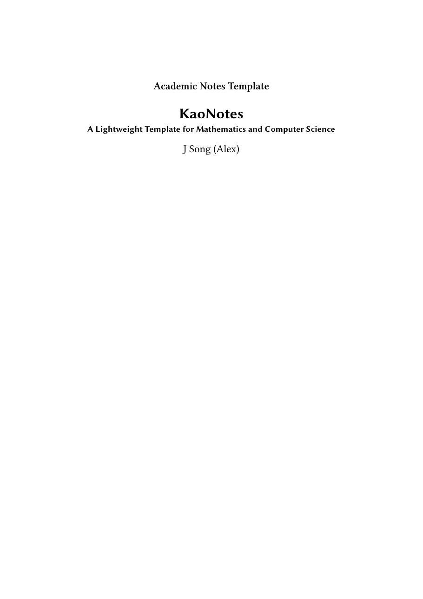

# KaoNotes

[](https://doi.org/10.5281/zenodo.22018510)

**English** · [繁體中文](README.zh-TW.md)

A lightweight, research-oriented LaTeX framework for compact academic notes — multilingual writing, mathematics, and computer science. Developed alongside KAN research and adapted from the wide-margin design of [kaobook](https://github.com/fmarotta/kaobook).

<p align="center">
  
</p>

<p align="center">
  <a href="kaonotes-preview.pdf">Four-page preview (PDF)</a>
</p>

> **v0.1.1** — synchronises the published four-page preview and source package, restores Noto Serif TC for Traditional Chinese, and credits J Song (Alex) on the cover.
>
> Zenodo: concept DOI [10.5281/zenodo.22018510](https://doi.org/10.5281/zenodo.22018510) · this version [10.5281/zenodo.22018865](https://doi.org/10.5281/zenodo.22018865)

## Features

- **Multilingual by default** — English, Traditional Chinese, Simplified Chinese, and mixed-language documents in a single file, with font switching that does not disturb the page design.
- **Built for mathematics and CS** — lecture notes, derivations, proofs, formulas, algorithms, code examples, and research notes.
- **Wide-margin layout** — margin notes, definition boxes, and dark-grey information boxes inherited from kaobook.
- **Code as first-class content** — monochrome listings with captions, and monospaced inline examples (e.g. PyTorch tensors) set like displayed formulas.
- **Reproducible builds** — `latexmkrc` and `build.ps1` included.

## Requirements

Install a TeX distribution providing **XeLaTeX**, `latexmk`, **Biber**, and **MakeIndex**. XeLaTeX is required for the multilingual settings.

| Purpose | Default font |
| --- | --- |
| Traditional Chinese | Noto Serif TC / Noto Sans TC |
| Simplified Chinese (limited example) | LXGW Neo ZhiSong |
| Code | JetBrains Mono |

Any of these can be replaced with an installed alternative in `main.tex`.

## Quick start

1. Clone or download this repository.
2. Edit the title, subtitle, author, and language settings in `main.tex`.
3. Create a chapter, e.g. `chapters/my-notes.tex`.
4. Add `\input{chapters/my-notes.tex}` to the main-body section of `main.tex`.
5. Build:

```powershell
.\build.ps1
```

Or, on any platform with `latexmk`:

```sh
latexmk main.tex
```

The generated `main.pdf` is intentionally not tracked during development.

## Examples

[`examples/multilingual-code.tex`](examples/multilingual-code.tex) is a complete, compilable file demonstrating English mathematical writing with a definition box, a Traditional Chinese note with mixed English terminology, a Simplified Chinese note with a dark-grey information box, and a captioned monochrome Python listing.

Compile it from the repository root:

```sh
xelatex -output-directory=examples examples/multilingual-code.tex
```

The same patterns work inside any chapter:

```tex
\section{繁體中文範例}
矩陣乘法可以寫成 \(A\mathbf{x}=\mathbf{b}\)。

\section{\zhHans 简体中文示例}
{\zhHans 矩阵乘法可以写成 \(A\mathbf{x}=\mathbf{b}\)。}

\begin{lstlisting}[language=Python]
def square(x):
    return x * x
\end{lstlisting}
```

## Reference document

The included chapter in `chapters/` is both a set of study notes and a compact demonstration of the framework: matrix equations, vectors, and worked derivations; a Traditional Chinese chapter title and introduction; a short Simplified Chinese section heading; a PyTorch tensor example; and definitions, remarks, and margin notes.

The examples are deliberately brief. They show that one document can combine mathematics, English, Traditional Chinese, Simplified Chinese, and source code while keeping the chapter visually consistent. The scope of KaoNotes is not limited to the linear-algebra example shipped here.

## Project structure

```
main.tex                  document configuration and entry point
chapters/                 research-note chapters
examples/                 complete multilingual and source-code examples
kaobook.cls, kao*.sty     upstream class and supporting packages
build.ps1, latexmkrc      reproducible local build configuration
```

## Licensing

KaoNotes uses **file-level dual licensing**:

| Files | Licence |
| --- | --- |
| kaobook-derived class, package files, project-level framework | LaTeX Project Public License 1.3c or later |
| Maintainer's original reference-note prose, calculations, examples, and compiled reference document | Creative Commons Attribution-NonCommercial 4.0 International |

This repository is derived from Federico Marotta's [kaobook](https://github.com/fmarotta/kaobook), itself based on work by Ken Arroyo Ohori and Tufte-LaTeX. Upstream authorship is preserved in the source headers and `MANIFEST.md`. Documents produced with KaoNotes remain the work of their respective authors.

See [LICENSE.md](LICENSE.md), [LICENSE-LPPL-1.3c.txt](LICENSE-LPPL-1.3c.txt), [LICENSE-CONTENT.md](LICENSE-CONTENT.md), and [NOTICE.md](NOTICE.md) for the exact file boundary and attribution details.

## Contact

Maintained by J Song (Alex), [@AlexandraSloan3](https://github.com/AlexandraSloan3).

- Academic or direct enquiries: [jsong.alex@proton.me](mailto:jsong.alex@proton.me)
- Usage questions, build problems, feature requests: [open an issue](https://github.com/AlexandraSloan3/kaonotes/issues)

When reporting a compilation problem, please include the TeX engine, operating system, and a minimal example.

---

If KaoNotes is useful to you, a ⭐ helps other researchers find it.
